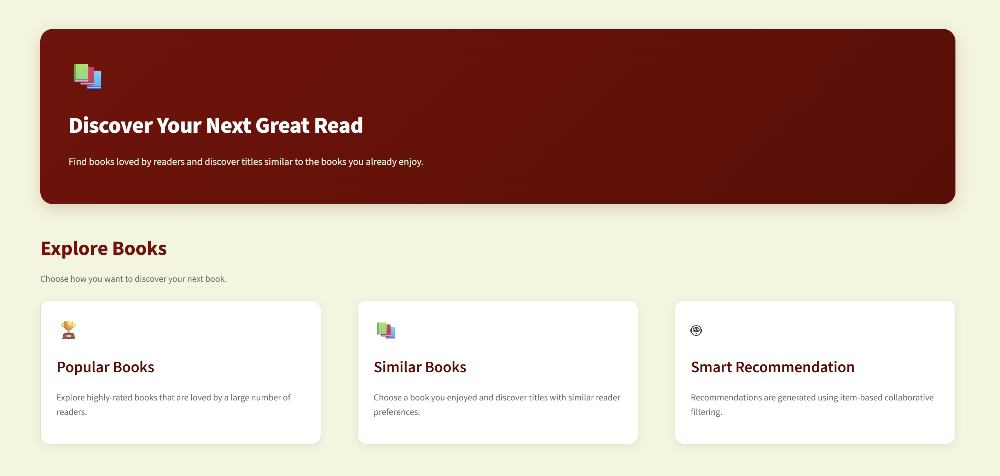
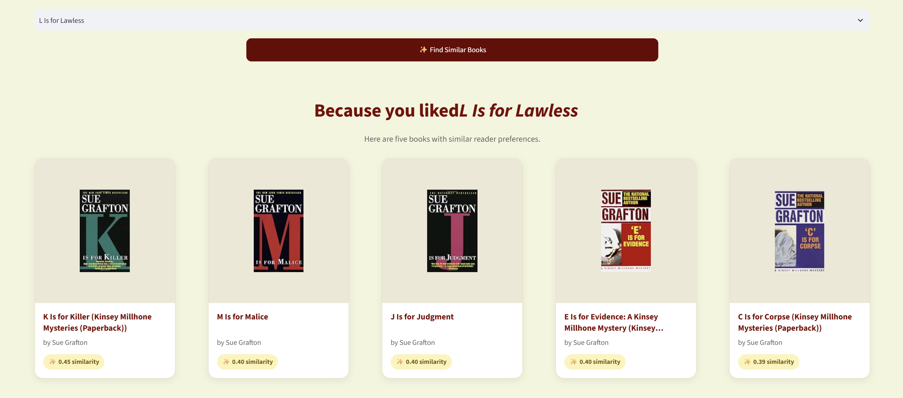

<div align="center">

# 📚 Book Recommender

**Discover your next favorite book — powered by collaborative filtering.**

A machine learning web app that recommends books based on what readers with similar taste have loved, trained on over a million real reader ratings.

[](https://www.python.org/)
[](https://streamlit.io/)
[](https://scikit-learn.org/)
[](LICENSE)
[](https://hybrid-book-recommender-system.streamlit.app)

[**🚀 Live Demo**](https://hybrid-book-recommender-system.streamlit.app) · [Report a Bug](../../issues) · [Request a Feature](../../issues)

</div>

---

## ✨ Why this project

Most "recommender system" tutorials stop at a Jupyter notebook. This one doesn't — it's a full pipeline from **raw data → trained model → deployed, usable web app**, built the way a real recommendation feature would be shipped:

- 🧠 **Real collaborative filtering** — not a lookup table. Recommendations come from cosine similarity over actual reader rating patterns.
- 🏗️ **Clean, modular codebase** — reusable `src/` package, not one giant notebook.
- ✅ **Tested** — pytest suite covering the model logic, not just "it ran without crashing."
- 🚀 **Actually deployed** — click the demo link above, no setup required to try it.
- 🎨 **Designed, not default** — a custom Streamlit theme, not the out-of-the-box look.

If you're learning recommender systems, ML deployment, or just want a clean reference for structuring a data science project — **star this repo** and dig in ⭐

---

## 📸 Preview

<div align="center">

| Landing Page | Recommendations |
|:---:|:---:|
|  |  |

</div>

---
## 🧩 How it works

The app uses two complementary recommendation strategies:

| Strategy | What it does | When it's used |
|---|---|---|
| **Popularity-based** | Ranks books by a *weighted rating score* (balances rating count vs. average rating, so a book with 5 perfect ratings can't outrank one with 500 great ratings) | Cold-start / "just show me something good" |
| **Item-based collaborative filtering** | Builds a Book × Reader ratings matrix, then computes cosine similarity between books based on how readers rated them | "I liked *this* — what's similar?" |

```
Raw Ratings (1M+)
      │
      ▼
Filter: active readers (200+ ratings) & well-rated books (50+ ratings)
      │
      ▼
Book × Reader Pivot Table
      │
      ▼
Cosine Similarity Matrix  ──►  recommend("1984") → Animal Farm, 1984-adjacent classics...
```

This filtering step matters: without it, the similarity matrix gets dominated by noise from one-off ratings. Restricting to readers and books with enough signal is what makes the recommendations actually feel relevant.

---

## 🛠️ Tech stack

| Layer | Tools |
|---|---|
| Data processing | `pandas`, `numpy` |
| Modeling | `scikit-learn` (cosine similarity) |
| App / UI | `Streamlit`, custom CSS |
| Testing | `pytest` |
| Deployment | Streamlit Community Cloud |

---

## 📂 Project structure

```
book-recommender-system/
│
├── data/
│   ├── raw/                        # source CSVs (not committed — see setup below)
│   └── README.md                   # dataset download instructions
│
├── notebooks/                      # EDA & experimentation
│   ├── 01_eda.ipynb
│   ├── 02_preprocessing.ipynb
│   └── 03_model_building.ipynb
│
├── src/recommender/                # core pipeline (importable, testable)
│   ├── data_loader.py              # load & merge raw CSVs
│   ├── preprocessing.py            # filtering + pivot table construction
│   ├── popularity_model.py         # weighted-score popularity ranking
│   ├── collaborative_model.py      # cosine similarity + recommend()
│   ├── train.py                    # runs the full pipeline, saves model artifacts
│   └── config.py                   # thresholds, paths, constants
│
├── models/                         # trained artifacts (pickled), generated by train.py
│
├── streamlit_app/                  # the deployed application
│   ├── app.py                      # landing page
│   ├── utils.py                    # cached model loaders
│   ├── style.css                   # custom theme
│   └── pages/
│       ├── 1_Popular_Books.py
│       └── 2_Recommend.py
│
├── tests/                          # pytest suite
├── requirements.txt
└── README.md
```

---

## 🚀 Getting started

### Prerequisites
- Python 3.10+
- The [Book-Crossing Dataset](https://www.kaggle.com/datasets/arashnic/book-recommendation-dataset) from Kaggle

### 1. Clone & set up the environment

```bash
git clone https://github.com/shre26/book-recommender-system.git
cd book-recommender-system

python -m venv .venv
source .venv/bin/activate      # Windows: .venv\Scripts\activate

pip install -r requirements.txt
```

### 2. Get the data

Download the dataset from Kaggle and place these three files in `data/raw/`:
```
data/raw/Books.csv
data/raw/Users.csv
data/raw/Ratings.csv
```

### 3. Train the models

```bash
python -m src.recommender.train
```

This generates the artifacts the app runs on:
```
models/popular_books.pkl
models/pivot_table.pkl
models/similarity_scores.pkl
models/books_meta.pkl
```

### 4. Run the app

```bash
streamlit run streamlit_app/app.py
```

Open `http://localhost:8501` and start exploring.

---

## 🧪 Running tests

```bash
pytest tests/ -v
```

Covers the popularity ranking logic and the collaborative filtering recommender — thresholds, sort order, edge cases like unknown book titles, and valid similarity score ranges.

---

## 📊 Dataset

[**Book-Crossing Dataset**](https://www.kaggle.com/datasets/arashnic/book-recommendation-dataset) — ~270,000 books, ~278,000 users, and over 1.1 million ratings collected from the Book-Crossing community.

---

## 🗺️ Roadmap

- [ ] Matrix factorization (SVD) model as a third recommendation strategy
- [ ] Hybrid scoring (blend popularity + collaborative signals)
- [ ] User-based (not just item-based) recommendations
- [ ] Dockerfile for containerized deployment

Have an idea? [Open an issue](../../issues) — contributions welcome.

---

## 🤝 Contributing

Contributions, issues, and feature requests are welcome!

1. Fork the repo
2. Create your branch (`git checkout -b feature/something-great`)
3. Commit your changes
4. Push and open a Pull Request

---

## 📄 License

Distributed under the MIT License. See [`LICENSE`](LICENSE) for details.

---

<div align="center">

If this project helped you learn something or you just liked digging through the code — **consider giving it a ⭐**, it genuinely helps.

Made with 📚 and a lot of `pandas.merge()`

</div>